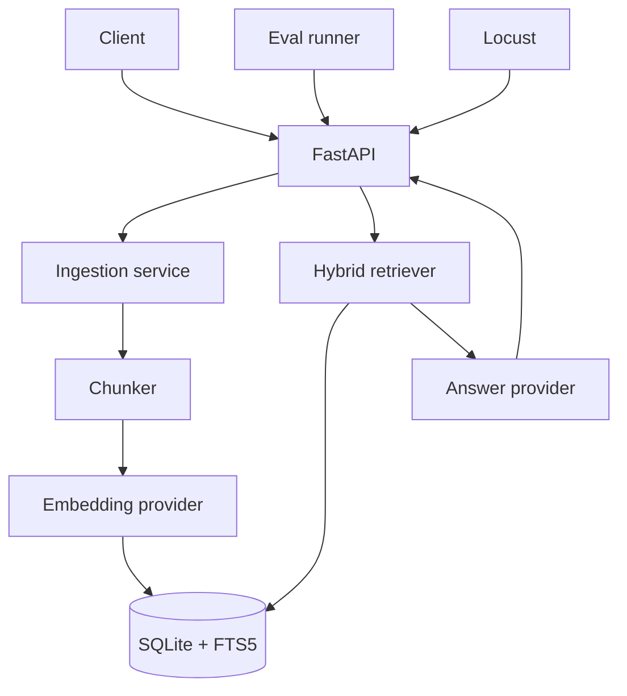

# Mini SIA — RAG Q&A Service

Mini SIA (Search & Insight Assistant) is a production-minded retrieval-augmented
generation service. Upload Markdown, text, or PDF documents, ask natural-language
questions, and receive grounded answers with chunk-level citations.

The repository intentionally includes the parts that AI demos often omit: hybrid
retrieval, deterministic offline tests, measurable eval gates, load tests,
observability, Docker packaging, and CI.

## What it demonstrates

- FastAPI service with typed request/response contracts and request IDs
- OpenAI Responses API for generation and Embeddings API for semantic retrieval
- SQLite FTS5 + cosine similarity with weighted hybrid ranking
- Batched ingestion, overlapping chunks, source metadata, and citation validation
- Offline evals for Recall@K, MRR, context precision, answer coverage, and citations
- Locust scenarios for realistic read-heavy traffic
- Prometheus metrics, structured logs, health checks, tests, Docker, and GitHub Actions
- Provider interfaces plus deterministic local providers for zero-cost CI

## Architecture



For a high-traffic deployment, keep the service and provider contracts and replace
the embedded store with PostgreSQL/pgvector or a managed vector database. The
current implementation favors a one-command portfolio demo without hiding the
retrieval algorithm behind a framework.

## Quick start (no API key)

```bash
python -m venv .venv
source .venv/bin/activate
pip install -e ".[dev]"
cp .env.example .env
export MINI_SIA_LLM_PROVIDER=extractive
export MINI_SIA_EMBEDDING_PROVIDER=hash
uvicorn mini_sia.main:app --reload
```

In another terminal:

```bash
curl -F "file=@data/demo/playback_analytics.md" http://localhost:8000/v1/documents

curl -s http://localhost:8000/v1/ask \
  -H 'Content-Type: application/json' \
  -d '{"question":"How are playback anomalies detected?","top_k":4}'
```

Interactive API docs are available at `http://localhost:8000/docs`.

## Run with OpenAI

Copy `.env.example` to `.env`, set `OPENAI_API_KEY`, and leave the two providers as
`openai`. Mini SIA uses `text-embedding-3-small` for retrieval and the Responses API
for answers. Model names and retrieval weights are configuration, not source-code
constants.

```bash
set -a && source .env && set +a
uvicorn mini_sia.main:app --host 0.0.0.0 --port 8000
```

The OpenAI Python SDK reads `OPENAI_API_KEY` from the environment. Never commit the
key; `.env` is ignored.

## API

| Method | Path | Purpose |
| --- | --- | --- |
| `GET` | `/v1/health` | Liveness and provider configuration |
| `POST` | `/v1/documents` | Ingest a `.txt`, `.md`, or `.pdf` file |
| `POST` | `/v1/ask` | Retrieve context and generate a cited answer |
| `GET` | `/metrics` | Prometheus metrics |

Example response:

```json
{
  "answer": "Scheduled jobs detect deviations from metric baselines [1].",
  "sources": [
    {
      "citation": 1,
      "document_id": "...",
      "filename": "playback_analytics.md",
      "chunk_id": "...",
      "page": null,
      "score": 0.91,
      "snippet": "..."
    }
  ],
  "latency_ms": 184.2
}
```

## Evaluation

The default eval is deterministic and free, so every pull request can enforce a
quality gate without external API access:

```bash
mini-sia-eval --local --fail-under 0.70 --output eval-results.json
```

To evaluate the real model and embedding path:

```bash
mini-sia-eval --provider openai --fail-under 0.70
```

Eval cases live in `evals/golden.jsonl`. Add production failures and adversarial
questions there as the system evolves. See [the eval guide](docs/evaluation.md).

## Load test

First ingest the demo files, then run an interactive test:

```bash
locust -f loadtests/locustfile.py --host http://localhost:8000
```

Or run a headless smoke test:

```bash
locust -f loadtests/locustfile.py --host http://localhost:8000 \
  --headless -u 20 -r 5 -t 60s --only-summary
```

Use the local providers when testing application capacity. Running a large load test
against an external model consumes quota and mostly measures that provider's limit.

## Development

```bash
make install
make lint
make test
make eval
```

Design decisions and scale-out tradeoffs are documented in
[docs/architecture.md](docs/architecture.md).

